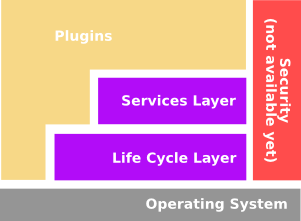
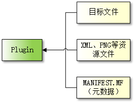
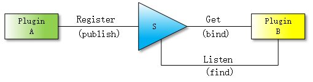

# `CTK Plugin Framework` 框架原理

## 一、CTK Plugin Framework 简单介绍

CTK Plugin Framework是一个用于动态加载和管理插件的开源框架。它基于OSGi规范，为开发人员提供了一种简单且轻量级的方式来构建可扩展的应用程序。允许开发人员将应用程序拆分为独立的模块，每个模块可以是一个插件。这些插件可以动态地安装、卸载和更新，从而实现应用程序的灵活性和可扩展性。它提供了一套API，开发人员可以使用这些API来定义和管理插件。它还包含了一些工具和实用程序，帮助开发人员快速开发和部署插件。CTK Plugin Framework是一个非常强大且易于使用的插件框架，适用于各种应用程序开发场景。

## 二、CTK Plugin Framework 体系架构

 

CTK Plugin Framework框架层次模型


CTK Plugin Framework框架的分层模型是一个结构化的设计，它将框架的不同功能分层组织，以促进插件的开发和互操作性。这个分层模型通常包括以下几个层次：

1. **插件层 (Plugins Layer)**: 这是框架中最顶层的组件，由开发人员创建的CTK组件组成。插件是框架的基本构建块，它们提供特定的功能，并且可以被动态加载到系统中。

2. **服务层 (Services Layer)**: 服务层通过提供一个发布-查找-绑定的模型，实现了插件之间的动态连接。这个模型允许插件发布它们提供的服务，同时也允许其他插件查找并绑定到这些服务上，从而促进了插件之间的通信和协作。

3. **生命周期层 (Life Cycle Layer)**: 生命周期层处理插件的生命周期管理，包括插件的安装、启动、停止、更新和卸载。这个层次提供了一系列API，用于管理插件的状态变化和生命周期事件。

4. **安全层 (Security Layer)**: 安全层负责处理与安全相关的方面，包括插件之间的安全通信和数据保护。尽管这部分在当前的实现中可能不可用或未完全实现，但它仍然是框架设计中考虑的一个重要部分。

通过这种分层模型，CTK Plugin Framework提供了一个清晰的结构和分离的关注点，使得插件的开发和管理变得更加高效和可管理。每个层次都有其特定的职责，而且这些层次之间通过定义良好的接口进行交互，从而提高了系统的灵活性和可维护性。

## 三、CTK Plugin Framework 插件

 

CTK Plugin Framework插件资源


在CTK Plugin Framework中，插件描述是指插件的元数据信息，用于描述插件的各种属性和特性。插件描述通常包括以下内容：

1. **插件标识符（Plugin Identifier）**：每个插件都有一个唯一的标识符，通常是一个字符串或数字。插件标识符用于在插件注册表中唯一标识一个插件。

2. **插件版本（Plugin Version）**：描述插件的版本号，用于标识插件的版本信息，便于插件的管理和更新。

3. **插件依赖性（Plugin Dependencies）**：描述插件对其他插件或服务的依赖性，确保插件能够正确地被加载和调用。

4. **插件导出服务（Plugin Exported Services）**：描述插件提供的服务接口或功能。其他插件可以通过插件服务来访问和调用插件提供的功能。

5. **插件扩展点（Plugin Extension Points）**：描述插件定义的扩展点和扩展。插件可以通过扩展点来扩展其他插件的功能，实现插件之间的解耦和灵活性。

6. **插件激活器（Plugin Activator）**：描述插件的激活器，负责插件的启动和停止时执行的逻辑。插件激活器通常实现了插件生命周期监听器接口，用于处理插件的生命周期事件。

插件描述是插件的重要组成部分，帮助插件管理器正确地加载、激活和管理插件。开发人员在开发插件时，需要编写和配置插件描述，确保插件能够正确地被识别和运行。插件描述使得插件具有更好的可维护性和可用性，同时也提高了插件的可扩展性和灵活性。

## 四、CTK Plugin Framework 插件元数据

CTK Plugin Framework 插件元数据是一组关键信息，用于描述和标识插件的特性。这些元数据为插件框架提供了关于插件的必要信息，以便正确加载、管理和使用插件。以下是CTK Plugin Framework 插件元数据的一些常见属性：

| key                       | 描述                 |
|:-------------------------:|:------------------:|
| `Plugin-Name`             | 插件名称               |
| `Plugin-SymbolicName`     | 插件符号名              |
| `Plugin-Copyright`        | 插件版权信息             |
| `Plugin-Description`      | 插件简要描述             |
| `Plugin-Vendor`           | 插件供应商              |
| `Plugin-Localization`     | 标识插件的 `Qt.qm` 文件名称 |
| `Require-Plugin`          | 依赖插件符号名            |
| `Plugin-Version`          | 插件版本号              |
| `Plugin-ActivationPolicy` | 插件激活策略             |
| `Plugin-UpdateLocation`   | 插件更新操作，新版插件目录      |

MANIFEST.MF 示例文件如下：

```c++
Plugin-SymbolicName: desktop
Plugin-ActivationPolicy:eager
Plugin-Category:
Plugin-ContactAddress:www.qtio.cn
Plugin-Description:
Plugin-Name: desktop
Plugin-Vendor: HouLei
Plugin-Version: 1.0.0
Require-Plugin: eventadmin,pluginadmin
```

## 四、CTK Plugin Framework 服务层

 

CTK Plugin Framework插件publish-find-bind 模型


在CTK Plugin Framework中，服务层是指用于定义和提供服务接口以实现插件间通信和功能扩展的一组功能。以下是关于CTK Plugin Framework服务层的一些描述：

1. **服务接口定义**：在服务层，开发人员可以定义服务接口，这些接口定义了插件所提供的功能和服务。其他插件可以通过这些接口来访问和调用服务。

2. **服务注册**：一旦定义了服务接口，开发人员可以将服务实现注册到服务注册表中。注册服务时会指定服务接口及对应的实现类，确保其他插件可以通过接口来访问服务。

3. **服务查找**：通过服务层提供的机制，插件可以查找和获取其他插件所提供的服务接口。这使得插件之间能够方便地进行通信和交互。

4. **服务调用**：当一个插件需要使用另一个插件提供的服务时，可以通过服务层进行服务调用。插件可以调用其他插件的服务接口来访问服务功能。

5. **服务监听**：服务层还提供了监听器机制，允许插件监听服务的状态变化，比如服务的注册、撤销等事件。

6. **依赖注入**：服务层还支持依赖注入机制，使得插件可以在运行时动态获取其他插件提供的服务，实现插件之间的松耦合。

通过服务层的机制，CTK Plugin Framework实现了插件间的解耦和增强了插件的可扩展性。开发人员可以按照服务接口的定义实现插件功能，注册和调用服务，实现插件之间的协作和通信。服务层是CTK Plugin Framework中非常重要的一部分，为插件的开发和整合提供了强大的支持。
